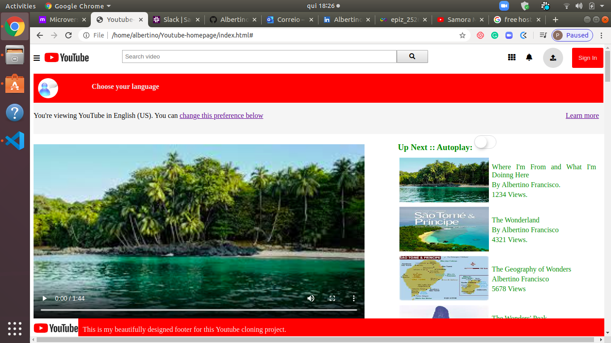

# Project Name

> Youtube-homepage Clone

 This is my first collaborative project, from the Microverse Main Curriculum,. This project consists of building an HTML document that matches the appearance of Youtube video player page.

## Built With

- HTML, CSS
- Visual Studo Code, Linters, Git, Github
- Ubuntu Operating System, Terminal, Internet

## Live Demo

[Live Demo Link](https://github.com/Albertino2020/Youtube-homepage/tree/working-branch)

## Getting Started

**This is an example of how you may give instructions on setting up your project locally.**
**Modify this file to match your project, remove sections that don't apply. For example: delete the testing section if the currect project doesn't require testing.**

To get a local copy up and running follow these simple example steps.

### Usage

## Authors

👤 Albertino Francisco

- Github: [@Albertino2020]https://github.com/Albertino2020)
- Twitter: [@albertino2050]https://twitter.com/albertino2050)
- Linkedin: [Alberino Francisco, Ph.D.](https://www.linkedin.com/in/boamorte/)

## 🤝 Contributing

Contributions, issues and feature requests are welcome!

Feel free to check the [issues page](issues/).

## Show your support

Give a ⭐️ if you like this project!

## Acknowledgments
This project has receive massive contribution from several people, specially my Microverse Stantup Team (Samuel, Phylis, Shabbab and Okikiola) and was reviewed by Desmond Adama, to whom I express my gratitude.

I'm also indebted to Adrian Iurca, who was my coding partner during the first 3 hours in this project and was so collaborative in this short period of time.

I obviously acknowledge other contributions that were not mentionned here but are eqially well noted.

## 📝 License

This project is [MIT](lic.url) licensed.
